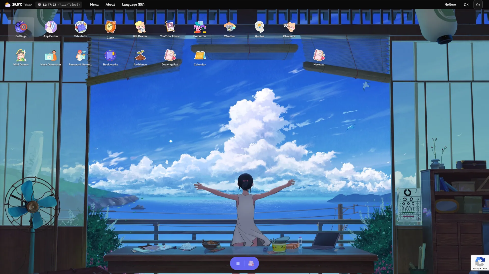
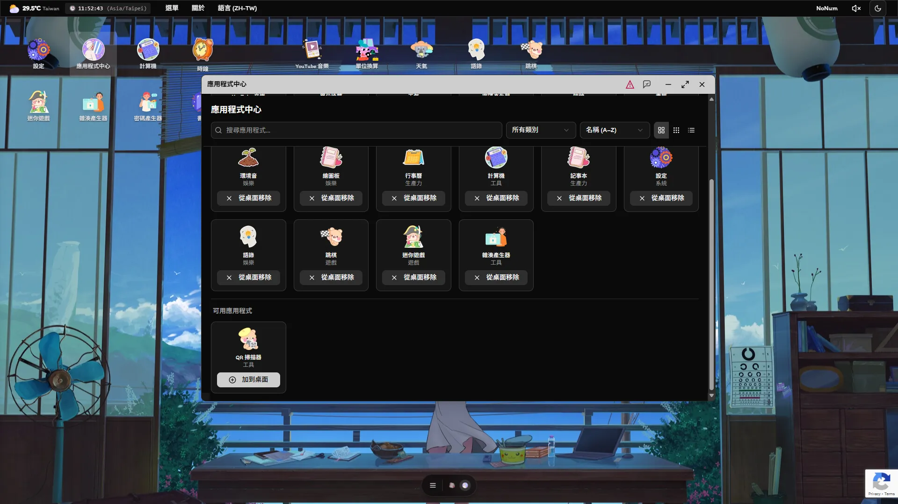

# Tabi-OS：互動式工具平台

<div class="text-xl opacity-75">
現代雲端桌面：模組化、多工具、社群驅動
</div>

<div class="mt-6 text-lg text-left pl-20">
  指導老師 : 陳玉專 <br/>
  專題學生：B12091202 陳英全
</div>

---
layout: two-cols
class: text-sm
---

# 大綱


::right::

<Toc minDepth="1" maxDepth="2" />

---
transition: fade-out
---

# 研究動機與目標

- <span v-click>現代數位工具普遍存在分散、效率低落的問題，導致用戶需在多平台間頻繁切換，造成操作不便與困擾。</span>
- <span v-click>Tabi-OS 旨在打造一**開放、模組化且可擴充**的雲端桌面平台。</span>
- <span v-click><strong>核心目標：</strong>促進協作與創新，同時降低大眾使用與開發者貢獻的門檻。</span>

---
transition: slide-up
---

# 專案緣起與核心理念

<div v-click>
<strong>緣起：</strong> 現有工具平台常因封閉或付費模式，限制了用戶的自訂彈性與社群貢獻機會。Tabi-OS 受多工具協作網站啟發，致力於提供更佳解決方案。
</div>

<div v-click class="mt-4">
<strong>核心理念：</strong>
<ul class="ml-6">
  <li v-click><strong>模組化設計：</strong> 各應用程式獨立存放於 <code>/src/apps/</code>，實現高內聚、低耦合。</li>
  <li v-click><strong>自動註冊機制：</strong> 新應用可透過 <code>/src/config/appRegistry.ts</code> 自動整合，無需修改全域程式碼，開發者得以專注單一 App 開發。</li>
  <li v-click><strong>開放架構：</strong> 鼓勵開源精神、促進社群協作與持續創新，打造以社群為核心的現代雲端桌面。</li>
</ul>
</div>

---
transition: slide-right
---

# 主要目標功能規劃

<div v-click>
<strong>平台目標：</strong> 建立穩健、高效能且可擴充的雲端桌面環境，基於 Next.js、React 及 Supabase。
</div>

<div v-click class="mt-4">
<strong>核心功能：</strong>
<ul class="ml-6">
  <li v-click>整合多種實用工具 (如書籤、音樂播放器、計算機、記事本、天氣查詢等)。</li>
  <li v-click>App Store：提供使用者探索、安裝、移除應用程式的介面，實現個人化桌面。</li>
  <li v-click>多視窗系統：模擬真實作業系統的操作邏輯與體驗。</li>
</ul>
</div>

<div v-click class="mt-4">
<strong>技術優勢：</strong>
<ul class="ml-6">
  <li v-click>SSR (伺服器端渲染) 提升初始載入效能與 SEO，並結合 <code>manifest.json</code> 與結構化 metadata 優化。</li>
  <li v-click>全面支援無障礙 (a11y) 與多語系 (i18n)，並採用極簡美學設計原則。</li>
</ul>
</div>

---
transition: fade-out
---

# 專案總覽與核心特色

- **Tabi-OS：** 一個模組化、用戶驅動的桌面平台，提供流線型工具組。
- **核心特色：**
  - <span v-click>每個 app 獨立於 `/src/apps/`，自動註冊，易於擴充</span>
  - <span v-click>App Store 探索/安裝/移除應用程式</span>
  - <span v-click>多視窗系統，模擬真實桌面操作</span>
  - <span v-click>SSR (伺服器端渲染) 提升效能與 SEO</span>
  - <span v-click>無障礙設計 (a11y) 與多語系支援 (i18n)</span>
  - <span v-click>重視效能、極簡設計與卓越使用者體驗</span>
  - <span v-click>開源精神，鼓勵社群參與及貢獻</span>

---
transition: slide-right
---

# 技術棧

- <span v-click><strong>核心框架：</strong> Next.js (v15.x), React (v19.x)</span>
- <span v-click><strong>語言：</strong> TypeScript (v5.x)</span>
- <span v-click><strong>狀態管理：</strong> Jotai (原子化、可擴展)</span>
- <span v-click><strong>樣式：</strong> Tailwind CSS (v4.x)</span>
- <span v-click><strong>UI 元件：</strong> Radix UI, shadcn/ui</span>
- <span v-click><strong>後端/資料庫：</strong> Supabase (PostgreSQL, Auth, RLS)</span>
- <span v-click><strong>套件管理/執行環境：</strong> Bun (v1.x)</span>
- <span v-click><strong>程式碼品質：</strong> ESLint, Husky, Commitlint</span>
- <span v-click><strong>其他：</strong> Docker, Cloudflare, Google reCAPTCHA, Vercel</span>

---
transition: fade-out
---

# 系統架構與資料夾結構

## 架構概述
- <span v-click><strong>前後端分離：</strong>
    - 前端 (UI/UX, 狀態): Next.js, React, Jotai
    - 後端 (資料, 認證): Supabase</span>
- <span v-click><strong>模組化設計：</strong> 每個應用程式 (<code>/src/apps/</code>) 獨立，高內聚低耦合。</span>
- <span v-click><strong>自動發現機制：</strong> 新應用無需修改全域程式碼即可註冊 (<code>/src/config/appRegistry.ts</code>)。</span>

---
transition: slide-left
---

# 資料夾結構 (1/4)：公用資源與主要應用 Apps

````md magic-move {lines: true}
```text {1|2-5|6|7|8|9-15|16-17|18|all}
public/                      # 公用資源根目錄（靜態檔案）
┣━ backgrounds/...              # 背景圖片資源
┣━ icons/...                    # 網站與應用的圖示資源
┣━ metadata/...                 # 網站的中繼資料（如 Open Graph、manifest 等）
┗━ sounds/...                   # 聲音資源（如提示音效等）
src/
┣━ apps/                       # 所有用戶應用程式（每個 app 一個資料夾）
┃  ┣━ clock/                    # 範例：時鐘應用
┃  ┃  ┣━ components/             #   應用程式專屬 React 元件
┃  ┃  ┣━ atoms/                  #   應用程式專屬 Jotai atoms（狀態）
┃  ┃  ┣━ hooks/                  #   應用程式專屬自定義 hooks
┃  ┃  ┣━ config.ts               #   應用程式設定（icon、預設大小等）
┃  ┃  ┣━ types.ts                #   應用程式專屬 TypeScript 型別
┃  ┃  ┣━ index.ts                #   應用程式註冊主入口
┃  ┃  ┗━ README.md               #  （選用）應用程式說明文件
┃  ┣━ calculator/
┃  ┃  ┗━ ...                     # 同上結構
┃  ┗━ ...                       # 其他應用程式
```
````

---
transition: slide-right
---

# 資料夾結構 (2/4)：共用元件 Components

````md magic-move {lines: true}
```text {1|2|3|4-11|all}
src/
┃  ... (public/, apps/)
┣━ components/                 # 共用 UI 元件
┃  ┣━ ui/                       #   Shadcn、Radix 等基礎 UI
┃  ┣━ layout/                   #   佈局元件（Window、Taskbar、Sidebar 等）
┃  ┣━ appstore/                 #   應用程式商店/探索元件
┃  ┣━ auth/                     #   認證 UI（登入表單等）
┃  ┣━ desktop/                  #   桌面圖示及相關元件
┃  ┣━ debug/                    #   除錯工具/元件
┃  ┣━ shared/                   #   共用元件（如 LoadingSpinner）
┃  ┗━ providers/                #   Context 提供者（Theme, Auth, Jotai 等）
```
````

---
transition: slide-left
---

# 資料夾結構 (3/4)：核心配置與基礎設施

````md magic-move {lines: true}
```text {1|2|3|4-5|6|7-8|9|10-11|all}
src/
┃  ... (public/, apps/, components/)
┣━ application/                # 全域應用程式邏輯
┃  ┣━ atoms/                    #   全域 Jotai atoms（window、auth 等）
┃  ┗━ hooks/                    #   全域自定義 hooks
┣━ config/                     # 全域設定
┃  ┣━ appRegistry.ts            #   所有可用 app 的註冊中心
┃  ┗━ ...                       #   其他全域設定檔
┣━ infrastructure/             # 基礎建設層
┃  ┣━ lib/                      #   外部函式庫、SDK（如 Supabase client）
┃  ┗━ utils/                    #   工具函式（如 report.ts、localStorage helpers）
```
````

---
transition: slide-right
---

# 資料夾結構 (4/4)：全域資源與 Next.js App

````md magic-move {lines: true}
```text {1|2|3|4|5|6|7|8-9|all}
src/
┃  ... (public/, apps/, components/, core logic/)
┣━ locales/                    # 多語系檔案（en.ts、zh-TW.ts 等）
┣━ styles/                     # 全域樣式（Tailwind CSS 等）
┣━ types/                      # 共用型別/介面
┣━ utils/                      # 工具函式
┗━ app/                        # Next.js app 目錄（路由、佈局、API）
   ┣━ [locale]/                 #   多語系頁面/佈局
   ┗━ api/                      #   API 路由
```
````

--- 
transition: slide-up
---

# 主要功能與使用者體驗

- <span v-click>**模組化 App 系統：** 易於新增、管理、移除工具。</span>
- <span v-click>**自動發現 App：** 簡化開發者貢獻流程。</span>
- <span v-click>**多視窗互動：** 類真實桌面體驗，提高生產力。</span>
- <span v-click>**App Store：** 提供集中的工具探索與管理平台。</span>
- <span v-click>**持久化狀態：** 如回報冷卻時間，透過 localStorage 記憶。</span>
- <span v-click>**無障礙 (a11y) 與響應式設計：** 兼顧所有使用者。</span>
- <span v-click>**雲端同步 (Supabase)：** 支援認證、使用者偏好設定等。</span>

--- 
transition: fade-out
---

# 研究方法與開發流程

<div grid="~ cols-2 gap-4">
<div>

**研究方法：**
<ul class="mt-2 text-sm">
  <li v-click>文獻參考與現有平台分析</li>
  <li v-click>採用現代 Web 技術 (React, Next.js, Supabase, Bun, TypeScript)</li>
  <li v-click>敏捷開發，持續實作與反覆測試</li>
  <li v-click>CI/CD 自動化部署流程</li>
  <li v-click>重視用戶回饋，驅動產品優化</li>
  <li v-click>強調社群參與和貢獻</li>
</ul>

</div>
<div>

**開發流程：**
<ol class="mt-2 text-sm list-decimal list-inside">
  <li v-click>需求分析與目標設定</li>
  <li v-click>架構設計與技術選型</li>
  <li v-click>前後端開發與整合</li>
  <li v-click>UI/UX 設計與無障礙測試</li>
  <li v-click>部署、測試與持續優化</li>
  <li v-click>用戶測試與回饋收集</li>
  <li v-click>文件撰寫與成果展示</li>
</ol>

</div>
</div>

--- 
transition: slide-left
---

# 核心程式片段範例

```json [package.json (部分)]
{
  "scripts": {
    "dev": "next dev",
    "build": "bun run lint && next build",
    "start": "next start",
    "lint": "next lint --fix",
    "prepare": "husky"
  },
  "dependencies": {
    "next": "15.x",
    "react": "19.x",
    "@supabase/supabase-js": "^2.0.0",
    "jotai": "^2.x",
    "tailwindcss": "^4.x"
    // ... 其他依賴
  }
}
```
<div v-click class="text-sm opacity-75 mt-2">
此片段展示專案的關鍵依賴與核心腳本，反映了所選用的技術棧與開發流程中的自動化配置 (如 Husky 預提交檢查)。
</div>

--- 
transition: slide-up
---

# 優點與挑戰

<div grid="~ cols-2 gap-8">
<div>

**優點：**
<ul class="mt-2 text-sm">
  <li v-click>現代技術棧，高效能 (SSR)</li>
  <li v-click>模組化易擴充、易維護</li>
  <li v-click>自動 App 發現機制，簡化貢獻</li>
  <li v-click>支援多語系與無障礙設計</li>
  <li v-click>互動式、類桌面使用者體驗</li>
  <li v-click>開源且易於社群貢獻</li>
</ul>

</div>
<div>

**挑戰與取捨：**
<ul class="mt-2 text-sm">
  <li v-click>SSR 增加部署與除錯複雜度</li>
  <li v-click>多視窗及 App 管理的狀態複雜性</li>
  <li v-click>雲端同步的即時性與衝突處理</li>
  <li v-click>行動裝置 UX 需持續優化與適配</li>
  <li v-click>初始載入體積 (Bundle Size) 控管</li>
  <li v-click>新貢獻者對專案架構的學習曲線</li>
</ul>

</div>
</div>

--- 
transition: slide-right
---

# 研究成果展示 (UI 截圖)

<div class="grid grid-cols-2 gap-4 mt-4">
  
  
</div>
<div v-click class="mt-2 text-center text-sm opacity-80">
展示多視窗桌面系統、App Store、工具應用等核心介面。
</div>

--- 
transition: fade-out
---

# 未來展望

- **功能擴展：**
  <ul class="ml-6">
    <li v-click>支援更多第三方應用程式與插件系統</li>
    <li v-click>新增通知中心、日曆、即時聊天等核心應用</li>
    <li v-click>儀表板個人化自訂功能</li>
  </ul>
- **體驗優化：**
  <ul class="ml-6">
    <li v-click>強化雲端同步機制與可能的離線支援</li>
    <li v-click>行動裝置使用者體驗深度優化與適配</li>
  </ul>
- **生態建設：**
  <ul class="ml-6">
    <li v-click>擴展 API 接口，支援外部自動化與深度整合</li>
    <li v-click>持續優化系統效能、安全性與穩定性</li>
    <li v-click>擴大開發者社群，完善貢獻文件、教學與流程</li>
  </ul>

--- 
transition: slide-up
---

# 如何貢獻 (簡要)

- **新增 App：**
  <ul class="ml-6">
    <li v-click>於 <code>/src/apps/</code> 建立新資料夾 (建議 kebab-case 命名)</li>
    <li v-click>需包含 <code>index.ts</code> (主出口), <code>config.ts</code> (視窗配置), <code>README.md</code> (說明)</li>
    <li v-click>App 將透過自動發現機制註冊至系統</li>
  </ul>
- **翻譯：**
  <ul class="ml-6">
    <li v-click>平台層級翻譯：<code>/src/locales/</code></li>
    <li v-click>應用程式翻譯：<code>/src/apps/[appName]/locales/</code></li>
  </ul>
- <span v-click>**其他：** 歡迎透過 GitHub Issues 回報錯誤、提出功能建議、或協助改進文件。</span>

<div v-click class="mt-4 text-sm opacity-75">
更詳細的貢獻指南與規範，請參閱專案根目錄下的 <code>CONTRIBUTING.md</code> 檔案。
</div>

--- 
transition: slide-right
---

# Q & A

<div class="text-xl opacity-80 mt-8">
感謝您的聆聽，歡迎提問！
</div>

--- 
transition: zoom-in
layout: center
class: text-center
---

# 感謝您的關注與參與！

Tabi-OS 期待與您一同成長。

<div class="mt-8 text-sm">
  <a href="https://github.com/NoNum3/tabi-tabi-os-main" target="_blank" rel="noopener noreferrer">
    專案 GitHub
  </a>
</div>

